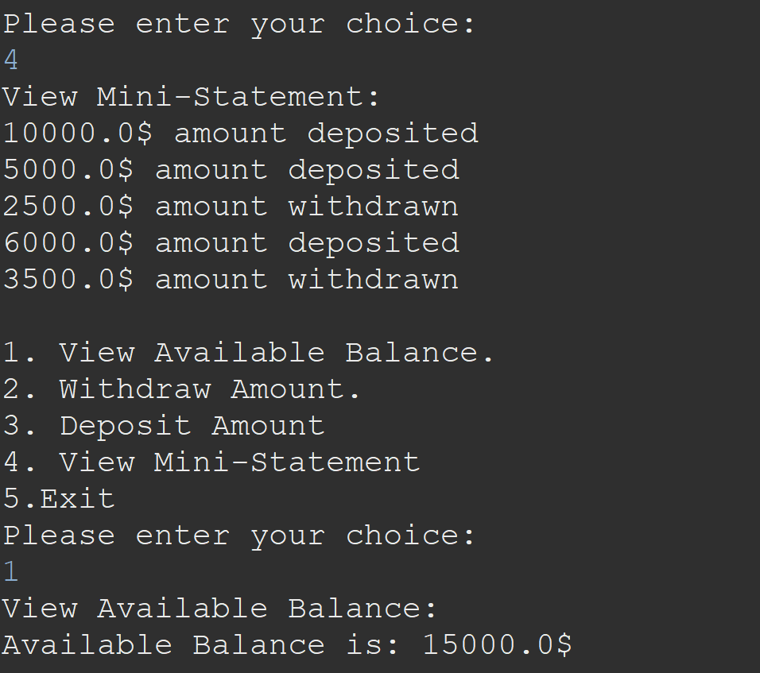

# ATM Machine Application Documentation



## Overview

Welcome to the ATM Machine Application, a Java-based solution for basic banking transactions. This application provides users with the essential functionalities of a typical Automated Teller Machine, offering the ability to view the balance, withdraw money, deposit money, and view a mini-statement. Authentication is done using an ATM number and PIN.

## Features

### 1. View Balance

Users can check their account balance by selecting the "View Available Balance" option. The application displays the current balance, providing users with real-time information about their account status.

### 2. Withdraw Money

The "Withdraw Amount" functionality allows users to specify the amount they wish to withdraw from their account. The application validates the withdrawal request, updates the account balance, and dispenses the requested amount if sufficient funds are available.

### 3. Deposit Money

For deposit transactions, users can input the amount they want to deposit into their account. The application verifies the deposit request, updates the account balance, and reflects the deposited amount in the user's account.

### 4. View Mini-Statement

Users can request a mini-statement to review the recent transactions on their account. The mini-statement displays a concise summary of the latest withdrawals and deposits, providing users with a quick overview of their transaction history.

## Authentication

To use the ATM Machine Application, users must provide their ATM number and PIN for authentication.

## How to Use

1. **Authentication**: Enter your ATM number and PIN to access the ATM services.
2. **View Balance**: Select the "View Available Balance" option to check your account balance.
3. **Withdraw Money**: Choose the "Withdraw Amount" option, enter the withdrawal amount, and follow the prompts to complete the transaction.
4. **Deposit Money**: Opt for the "Enter the amount to be Deposited" option, input the deposit amount, and follow the instructions to complete the deposit transaction.
5. **View Mini-Statement**: Select the "View Mini-Statement" option to access a summary of recent transactions.

## Sample Code

```java
// Sample code snippet for authentication
if(atmNumber==atmNumByUser && atmPin == atmPinByUser) {
			System.out.println("___Validation Done Successfully___ \n");
			int flag=0;
			while(true) {
				menu();
				System.out.println("Please enter your choice: ");
				int choice = sc.nextInt();
				switch(choice) {
				case 1:
					System.out.println("View Available Balance: ");
					operation.viewBalance();
					break;
				case 2:
					System.out.println("Withdraw Amount: ");
					operation.withdrawnAmount();
					break;
				case 3:
					System.out.println("Enter the Amount to be deposited: ");
					double depositAmount = sc.nextDouble();
					operation.depositAmount(depositAmount);
					break;
				case 4:
					System.out.println("View Mini-Statement: ");
					operation.miniStatement();
					break;
				case 5:
					System.out.println("Please collect your ATM Card. \nThanks for Banking with us!! ");
					flag=1;
					break;
				default:
					System.out.println("Please enter correct choice");
					break;
				}
				if(flag==1)
					break;
			}
			
		}
		else {
			System.out.println("Incorrect ATM Pin/Number !!!");
		}
}
